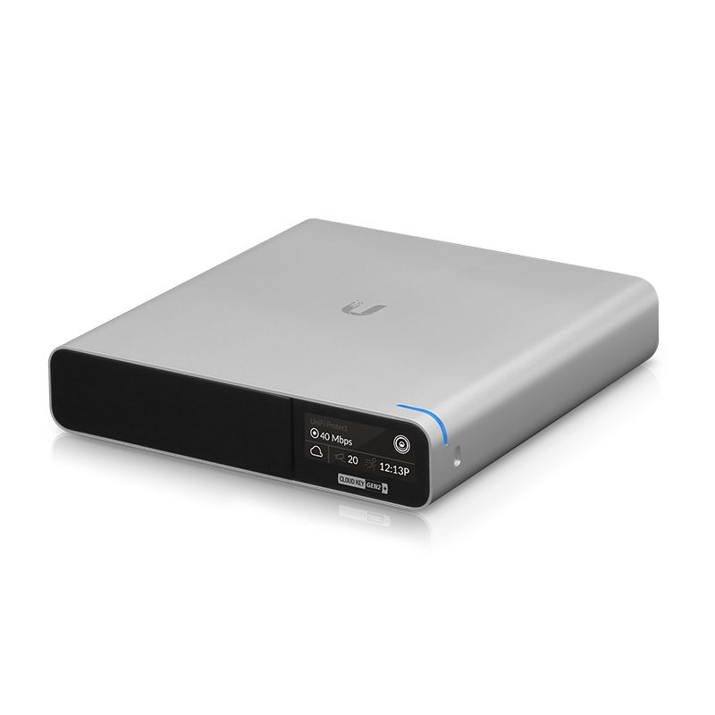

# Ubiquiti Unifi Cloud Key Gen 2 Backup to FTP



With the latest Firmware Update (>2.0) of the Ubiquiti Cloud Key Generation 2, Ubiquiti stopped using the SD-Card as backup location for automatic backups. Otherwise the new firmware release is doing backups to the local HDD (at Cloud Key Gen 2 Plus), which is harder to access on a hardware error or a general failure.

For security reasons, enabling SSH on the Cloud Key all the time and pull the backups from the Cloud Key was not an option for me, as SSH on the Coud Key is not restricted by a firewall or public key authentication. So, SSH could be accessed by any device on the network by just using password authentication.

Pushing backups was the only option. For that, I built this shell script, which sets up everything you need, copies the backups to an external FTP server on your network or the internet. The script uses and configures CRON on the Cloudkey to run every hour.

:exclamation: As a firmware update resets the changes, you have to manually run the script once after every firmware upgrade.

> If you have a Unified Dream Machine, have a look at my FTP backup for Ubiquiti Dream Machine using a Docker container. [aessing/udm-backup-ftp](https://github.com/aessing/udm-backup-ftp) 

## Steps to get up and running

1. Customize the [uck-backup-ftp.sh](uck-backup-ftp.sh) script and copy it over to your Cloud Key Gen 2. I recommend to copy the script to the `/srv` directory.

    * In the scirpt are 4 variables, which are used by the script to logon to the FTP server and copy over the backups. 
        ```shell
        FTP_SERVER={SERVERNAME}
        FTP_PATH={BACKUPPATH}
        FTP_USER={FTPUSER}
        FTP_PASSWORD={FTPPASSWORD}
        ```

    * To copy the script, you have to enable SSH on the Cloud Key (don't forget to deactivate it after you finished) and use scp or a tool of your choice to copy over the script.  
        ```shell
        scp uck-backup-ftp.sh root@[CLOUD_KEY_IP]:/srv
        ```

1.  Login to the Cloud Key via SSH and set the right permissions to the script so it can be executed.
    ```shell
    chown root.root /srv/uck-backup-ftp.sh
    chmod 500 /srv/uck-backup-ftp.sh
    ```

1. Last but not least, you have to run the script manually once to set everything up.  
During the first run, it will
    * set up a directory which will be mirrored to the FTP server
    * install a FTP client ([_LFTP_](https://github.com/lavv17/lftp))
    * sets up the cron job
    * mirrors the backups to the FTP for the first time
        ```shell
        cd /srv
        ./uck-backup-ftp.sh
        ```

---

## :ambulance: Support Information

For further information about this project, how to [contribute](CONTRIBUTING.md), or how to contact us, please have a look at the [support document](SUPPORT.md) of this repository. It also contains information about [security related topics](SECURITY.md), [licensing](LICENSE.md), and more.  

## :man_judge: Disclaimer

THE CONTENT OF THIS REPOSITORY IS PROVIDED "AS IS", WITHOUT WARRANTY OF ANY KIND, EXPRESS OR IMPLIED, INCLUDING BUT NOT LIMITED TO THE WARRANTIES OF MERCHANTABILITY, FITNESS FOR A PARTICULAR PURPOSE AND NONINFRINGEMENT. IN NO EVENT SHALL THE AUTHORS BE LIABLE FOR ANY CLAIM, DAMAGES OR OTHER LIABILITY, WHETHER IN AN ACTION OF CONTRACT, TORT OR OTHERWISE, ARISING FROM, OUT OF OR IN CONNECTION WITH THE CONTENT OF THIS REPOSITORY OR THE USE OR OTHER DEALINGS BY CONTENT OF THIS REPOSITORY.